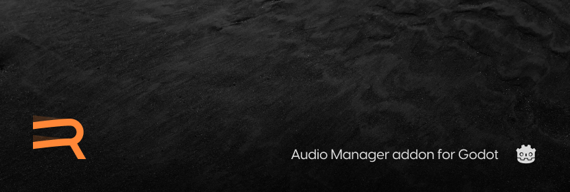

---

# ***Resonate***

An all-in-one sound and music management addon for the Godot game engine.

## Supporting this project
This addon is free for personal & commercial use (under the [MIT license](LICENSE)). However, if you'd like to support this project financially, consider becoming a HugeMenace Patreon or purchasing this addon from Gumroad, where you can pay what you want 🌿

## Features
- Pooled audio stream players.
- Automatic 2D and 3D space detection.
- Polyphonic playback.
- Stemmed music tracks.
- Music crossfading.

## TL;DR

Resonate has two core systems: the **SoundManager** and the **MusicManager**.

The **SoundManager** automatically pools and orchestrates **AudioStreamPlayers** for you and gives you control over the players when needed. 

The **MusicManager** composes music tracks built from ***stems*** and supports the (cross)fading of tracks or stems out of the box.

Resonate is the solution for when you need more than just the basics, but don't need a sophisticated or complicated audio system such as FMOD or Wwise.

## Docs

- [SoundManager documentation](docs/sound-manager.md)
- [MusicManager documentation](docs/music-manager.md)

## Examples

This repo is a Godot project you can clone and run.

Inside of the `examples/` folder are scenes demonstrating all the Sound and Music manager's features.

## Getting the addon

You have a few different options:

- You can download Resonate from the Godot Asset Library (or from within the editor). 
- You can grab the latest version from the [Github releases page](https://github.com/hugemenace/resonate/releases).
- You can also clone or download this repo, then extract the `addons/resonate` directory into the root folder of your Godot project.
- You can grab the addon from [Gumroad](https://hugemenace.gumroad.com/l/resonate-godot-addon) (if you'd like to financially support this project).

## License

This project is provided ***free for personal and commercial use*** under the [MIT license](LICENSE) ❤
