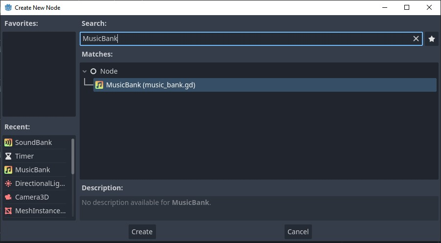
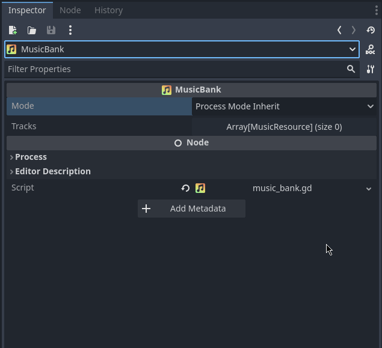
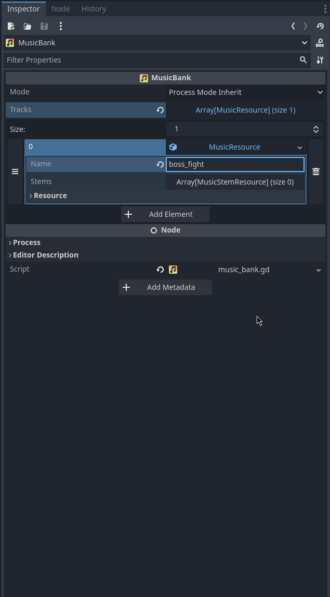

# MusicManager

## Introduction

The **MusicManager** is responsible for playing music tracks. It does so through a **StemmedMusicStreamPlayer** (SMSP), which extends Godot's **AudioStreamPlayer**. The core feature of SMSPs, as the name suggests, is the management and playback of ***stems***.


Stems are music tracks split horizontally. For example, a music track may be split into pad, melody, and drum stems. Each of these stems can be played in isolation or in-sync with any or all of the other stems. This feature (while not required) allows you to craft more dynamic in-game music. For example, while the player is far enough away from a boss, only the pad stem plays. Then when the player gets closer, the melody stem gets added in. Finally, when the player is within the boss's detection distance, the drum stem gets added in. This helps you form a music track that grows in intensity without having to swap music tracks in and out entirely. It's a more organic and seamless transition.

### MusicBanks

The way you configure music is through the use of **MusicBanks**. Each MusicBank contains one or more music tracks, each of which contains one or more stems. Each stem contains one audio stream.


**MusicBanks** are automatically discovered by the **MusicManager** when your game starts, and can be located anywhere in your active scene(s).

### Fading & crossfading

Whenever you start or stop either an entire music track or a single stem, you can provide a (cross)fade time. If you want either of those to start immediately, just provide a (cross)fade time of zero seconds.

## Usage

### Creating MusicBanks

#### Step 1

Add a new MusicBank node to your scene.



#### Step 2

Give your new MusicBank a label and then create a new MusicTrackResource. A MusicTrackResource represents one track in your music bank. Each track requires a name, which you will use to start it from your script(s).



#### Step 3

Create as many MusicStemResources as you track requires. Each stem requires a name, which you will use to enable or disable it from your script(s). If you mark a stem as enabled at the resource level, it will automatically be started for you when you play the music track. If often makes sense to have you core stem enabled by default.



### Playing music

To start a new music track, just call the `play` method on the MusicManager with the name of the bank and track you want to play.

```GDScript
MusicManager.play("combat", "boss_fight")
```

To enable or disable stems on the currently playing track, just call `enabled_stem` or `disable_stem`.

```GDScript
MusicManager.enable_stem("melody")
MusicManager.disable_stem("drums")
```

## API

### Functions

#### Play

Will start playing the specified music track and stop any tracks currently playing.

`play(p_bank_label: String, p_track_name: String, p_crossfade_time: float = 5.0) -> void`

| Parameter | Type | Description |
| --- | --- | --- |
| `p_bank_label` | **Required** | The label of the music bank you want to play from |
| `p_track_name` | **Required** | The name of the music track you want to play |
| `p_crossfade_time` | Optional | How long to fade a new track in for, or how long to crossfade between the currently playing track and the one you're about to start |

#### Stop

Will stop the currently playing music track.

`stop(p_fade_time: float = 5.0) -> void`

| Parameter | Type | Description |
| --- | --- | --- |
| `p_fade_time` | Optional | How long to fade the track out for |

#### Is playing

Check whether the music manager is currently playing. Optionally, you can also check whether it is currently playing from a specific bank, a specific track, or the combination of both.

`is_playing(p_bank_label: String = "", p_track_name: String = "") -> bool`

| Parameter | Type | Description |
| --- | --- | --- |
| `p_bank_label` | **Required** | The label of the music bank you want to check is playing |
| `p_track_name` | **Required** | The name of the music track you want to check is playing |

#### Set volume

Will set the volume level for all currently playing, or future music. If a track is in the middle of fading in or out, setting the volume will immediately cancel the fade and cause the volume to be set at the specified amount.

`set_volume(p_volume: float) -> void`

| Parameter | Type | Description |
| --- | --- | --- |
| `p_volume` | **Required** | What volume to set the music to in dB |

#### Enable stem

Will start the specified stem on the currently playing music track.

`enable_stem(p_name: String, p_fade_time: float = 2.0) -> void`

| Parameter | Type | Description |
| --- | --- | --- |
| `p_name` | **Required** | The name of the stem you want to enable |
| `p_fade_time` | Optional | How long to fade the stem in for |

#### Disable stem

Will stop the specified stem on the currently playing music track.

`disable_stem(p_name: String, p_fade_time: float = 2.0) -> void`

| Parameter | Type | Description |
| --- | --- | --- |
| `p_name` | **Required** | The name of the stem you want to disable |
| `p_fade_time` | Optional | How long to fade the stem out for |


#### Set stem volume

Will set the volume level for the specified stem. If the stem is in the middle of fading in or out, setting the volume will immediately cancel the fade and cause the volume to be set at the specified amount.

`set_stem_volume(p_name: String, p_volume: float) -> void`

| Parameter | Type | Description |
| --- | --- | --- |
| `p_name` | **Required** | The name of the stem you want to update |
| `p_volume` | **Required** | What volume to set the stem to in dB |

### Signals

#### Loaded

Emitted when the MusicManager has loaded and is ready to play music tracks.

`signal loaded`

#### Banks updated

Emitted when the MusicManager has detected scene changes (node insertion & deletion) that resulted in MusicBanks being added or removed.

`signal banks_updated`

#### Updated

Emitted alongside `loaded` and `banks_updated` as a signal to hook into if you're wanting to fire the same callback for both events.

`signal updated`
