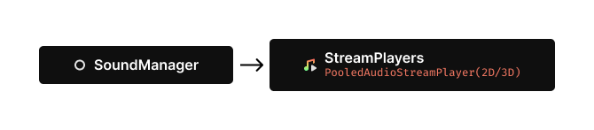
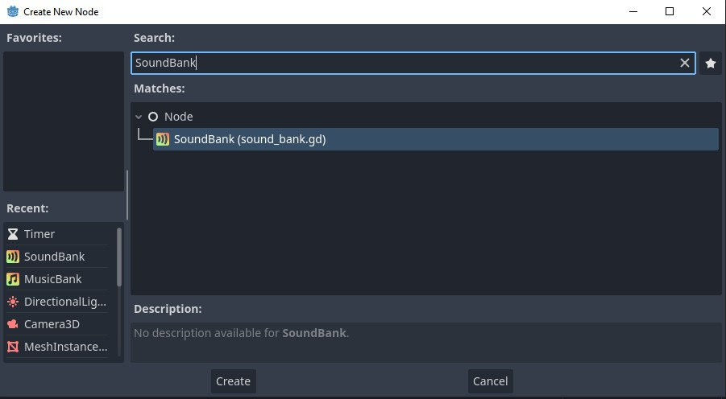
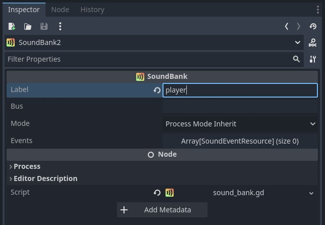
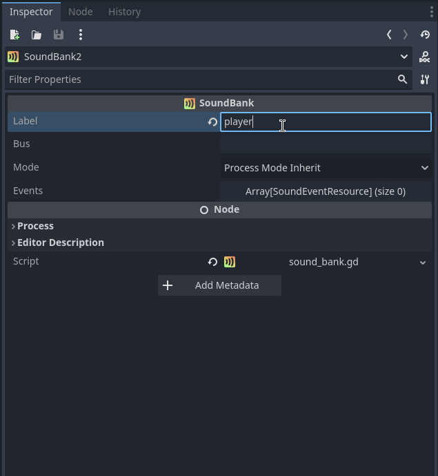
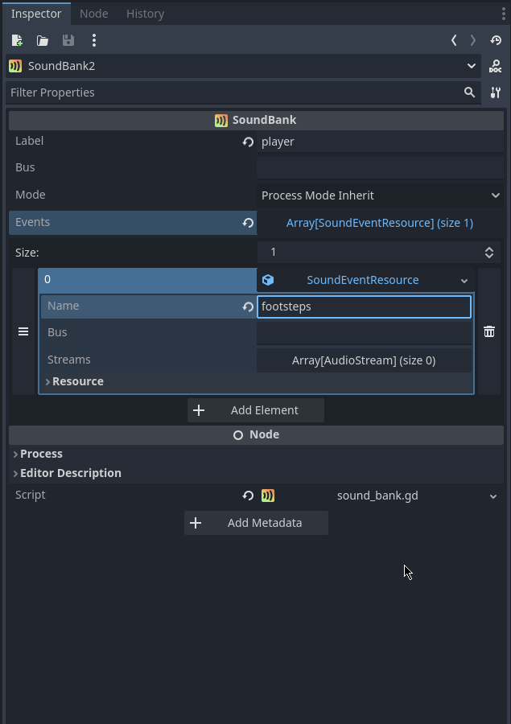

# SoundManager

## Introduction

The **SoundManager** is responsible for triggering sounds. It does so through **PooledAudioStreamPlayers** (PASPs), which extend Godot's native **AudioStreamPlayers** (ASPs). PASPs, like ASPs, support audio playback in 1D, 2D, and 3D space, making them useful for any game sound effect.



Sound events can be configured with multiple variations (audio streams) which are chosen at random when played. This can help create organic-sounding events such as footsteps, gunshots, collisions, etc.

### SoundBanks

The way you configure sound events and their variations is through the use of **SoundBanks**. Each **SoundBank** you create has a name and several associated events, among other configuration options.


**SoundBanks** are automatically discovered and loaded by the **SoundManager** when your game starts. This allows you to co-locate your **SoundBanks** with the entities or systems they belong to.

All registered sound events can be triggered in three ways: uniformly, at a fixed position, or attached to a node. Uniformly triggered sound events always play in 1D space and, therefore, will be heard as if coming from all directions (no stereo or 3D panning). Sound events triggered at a fixed position (Vector2/Vector3) or attached to a node (Node2D/Node3D) will automatically be positioned in 2D or 3D space. They will be heard accordingly through the use of panning.

When you trigger a sound event, the **SoundManager** will retrieve a free PASP from one of its appropriate 1D, 2D, or 3D pools. After the event, the PASP will be freed and returned to the pool, available for the next event. Using pools means you do not have to insert ASPs into your scenes manually. For performance reasons, however, the **SoundManager** will limit how many PASPs it creates in each pool. This limit can be configured under `Audio/Manager/Sound` in your project settings.

When you want to play a particular event consistently, you can request exclusive use of a PASP from the **SoundManager**. When doing so, it will not be automatically returned to its pool when an event has finished playing. It can be manually released if you wish to return it to its pool.

### Polyphony

By default, every PASP, when told to trigger an event, will play the event once. If instructed to trigger the event again while a previous variation is still playing, it will stop playback and immediately begin playing a new random variation. Polyphonic playback can be enabled in situations where this is undesirable, for instance, playing rapid gunshots. When told to trigger, polyphonic playback will start playing a random variation concurrently with all other variations already playing. The maximum number of concurrent variations a PASP can play can be configured under `Audio/Manager/Sound` in your project settings.

## Usage

### Creating SoundBanks

#### Step 1

Add a new **SoundBank** node to your scene.



#### Step 2

Set the label for your new **SoundBank**. **SoundBanks** are flexible in that they allow you to group your sounds however you want. The label in this case is the group name. Example labels could be "player", "UI", "gunshots", etc. The name you provide here is what you will use when calling the play or instance functions from your script(s).



#### Step 3

Create a new **SoundEventResource**. Each **SoundEventResource** is a single **event** in a **SoundBank**. The name you provide here is what you will use when calling the play or instance functions from your script(s).



#### Step 4

Add as many streams (variations) to the event as you need. These variations, chosen at random, are played when you trigger the event from your script(s).



You are now ready to trigger the event from your script(s).

### Triggering events

#### Simple

There are two ways to trigger events with the **SoundManager**. The first way is to automatically trigger the event and have the **SoundManager** handle everything for you. 

```GDScript
SoundManager.play("player", "footsteps")
```

Using this approach (any **SoundManager** method starting with `play`) will cause the **SoundManager** to pick a free player from the pool, trigger your event on it, and immediately return it to the pool once the sound has finished playing.

#### Advanced

The second way is to manually trigger events. To manually trigger an event, you need to first `instance` a sound event. When a sound event is instanced, the **SoundManager** will return a reserved **PooledAudioStreamPlayer**. You can save a reference to this player and call the `trigger` method on it whenever you want to trigger the reserved event.

`trigger() -> void`

See the following example below:

```GDScript
var instance = SoundManager.instance_poly("player", "footsteps")

instance.trigger()
```

When using an instanced sound event, its your duty to release it back to the pool if you're done using it. This can be achieved by calling the `release` method.

```GDScript
instance.release()
```

However, it's often the case that an instanced sound event will be used indefinitely by the calling script, in which case you do not need to call `release`.

#### Automatic space detection

When calling the `play` or `instance` methods, the **SoundManager** will use a 1D space **PooledAudioStreamPlayer**. If you require an event to be played in 2D or 3D space, you'll need to use one of the extended `play` or `instance` methods (see the API references below.)

#### Polyphonic playback

The `instance` method also offers a further extension which allows you to reserve a **PooledAudioStreamPlayer** in a polyphonic configuration (see the API references below.)

#### Varying pitch and volume

As it's quite common to want to vary the pitch and/or volume of an event, we've added an extended version of the `trigger` method called `trigger_varied`:

`trigger_varied(p_pitch: float = 1.0, p_volume: float = 0.0) -> void`

The `trigger_varied` method works for both polyphonic and non-polyphonic events.
